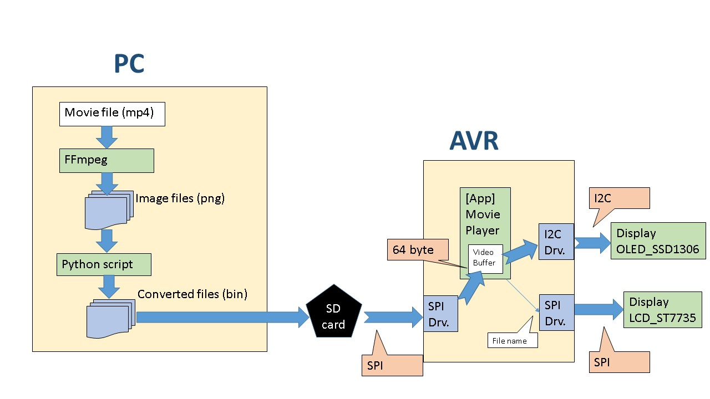
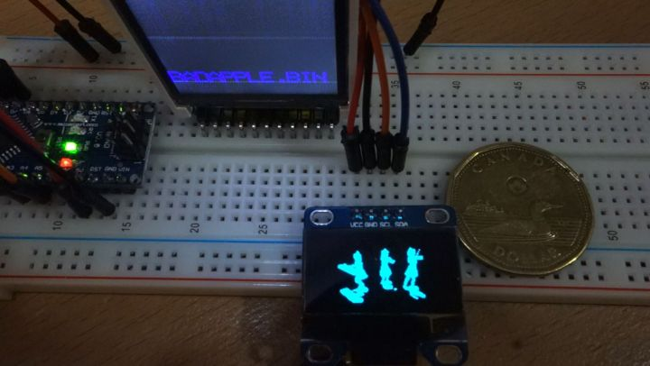
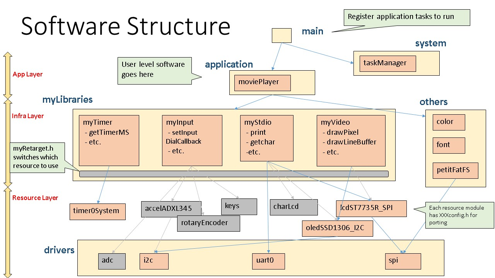

# Movie Player (Black and White)

This is a tiny (128 x 64 pixel) black and white movie player running on ATmega 328. This device plays converted image data saved in SD card.

Link to youtube is bellow:  
[](http://www.youtube.com/watch?v=grzDsh2M5ko)


## Environment
* Atmel Studio 7.0

## Devices
* ATmega328P (not arduino)
* OLED SSD1306 Display (I2C)
* SD card (SIO)

## PC Side
### Software needed
* ffmpeg
* python 2.7.x

### Libraries needed
* pip install PIL

### How to Convert
```
%> export PATH=$PATH:/C/tool/ffmpeg/bin
%> mkdir temp
%> ffmpeg -i "videoname.mp4" -vcodec png ./temp/img-%04d.png
%> sh ./AllConvert.sh
%> cat ./temp/*.bin > video.bin 	#option
```
### Note
* Tools are in "00_tools" folder
* Converted image date is vertical order (not raster) because of display device specifications
* LCD_ST7735 is just to display file name. It's not  mandatory.
* There is unexpected interference between SD card and LCD despite of disabled CS...
* FPS controller doesn't work as I expected...

## Software Structure



## Portmap
```
## IO
PORTA0 = N/A
PORTA1 = N/A
PORTA2 = N/A
PORTA3 = N/A
PORTA4 = N/A
PORTA5 = N/A
PORTA6 = N/A
PORTA7 = N/A
PORTB0 = FATFS_MMC_CS
PORTB1 = LCD_ST7735_DC
PORTB2 = #ALWAYS OUTPUT# LCD_ST7735_CS
PORTB3 = LCD_ST7735_MOSI
PORTB4 = FATFS_MMC_MOSI. FATFS_MMC_MISO
PORTB5 = FATFS_MMC_CK. LCD_ST7735_SCK
PORTB6 = XTAL1
PORTB7 = XTAL2
PORTC0 = (INPUT_RotaryEncoder_A : IN)
PORTC1 = (INPUT_RotaryEncoder_B : IN)
PORTC2 = (INPUT_SW0)
PORTC3 = (INPUT_SW1)
PORTC4 = I2C_SDA
PORTC5 = I2C_SCL
PORTC6 = RESET
PORTC7 = N/A
PORTD0 = RX : IN
PORTD1 = TX : OUT
PORTD2 = (CHAR_LCD_EN : OUT)
PORTD3 = (CHAR_LCD_RS : OUT)
PORTD4 = (CHAR_LCD_D4 : OUT)
PORTD5 = (CHAR_LCD_D5 : OUT)
PORTD6 = (CHAR_LCD_D6 : OUT)
PORTD7 = (CHAR_LCD_D7 : OUT)
ADC6   = (INPUT_POS0)
ADC7   = (INPUT_POS1)

## Function
USART0 = COM
TIMER0 = System Timer (1msec)
TIMER1 = 
TIMER2 = 
SIO = LCD_ST7735, SD card
I2C = Accelerometer (ADXL345), OLED_SSD1306

## Note
LCD_ST7735_RES is set VDD
```
